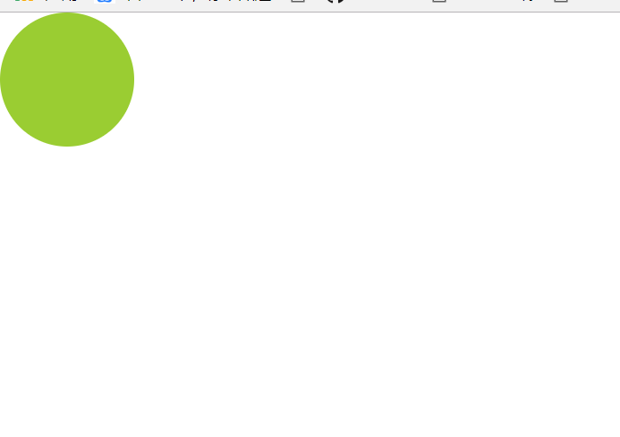

Cookie & Ajax
==============
- 技术：html + css + javascript + WampServer
- 该项目内容：页面内有一个方块，你打开页面拖拽它，关闭后在打开它仍然会在你之前拖拽的位置。
- 简单的使用原生JS封装了cookie和ajax。
- WampServer是一款由法国人开发的Apache Web服务器、PHP解释器以及MySQL数据库的整合软件包。
- 这款软件非常好用，一键安装后打开就能用。在没有服务器的情况下使用它可以创建一个本地服务器。
- 官网地址：http://www.wampserver.com/en/
- cookie: 实现增删改查。 我写了三个函数：setCookie(),removeCookie(),getCookie()。
- setCookie中需要三个传参，分别是cookie的名字，cookie的值，cookie的保质期。调用这个方法时创建一个Date实例，获取当前的时间，将当前的时间加上传入的第三个参数即为cookie的保质期。最后将三个参数拼接传给document。
- removeCookie只需要一个参数，你要删除的cookie的名字。将原来的cookie的保质期改为-1，即可删除。
- getCookie需要两个参数，为cookie的名字和回调函数名。先获取所有的cookie，后使用string的split方法将拼接的cookie分离，最后使用for循环遍历，找到将value返回。
- ajax： 我设置了五个参数。method：设置使用的方法是get或post， url：你需要去申请的地址， flag： 设置是否异步， data： 需要传入的数据， callback： 回调函数。
- ajax 对象
AJAX 最重要的两个对象:
1. XMLHttpRequest() // 主流浏览器
2. ActiveXObject(‘Microsoft.XMLHTTP’) // ie

通过这两个对象使 ajax 可以获取数据

- ajax 优缺点
AJAX 优点:
1. 页面无刷新
2. 使用异步的形式与服务器进行通信
3. 减轻服务器的负担
4. 不需要插件或者小程序

AJAX缺点:
1. 不支持浏览器的后退机制
2. 对搜索引擎支持较弱
3. 违背了 url 和 资源定位 的初衷

- ajax 步骤
1. 创建 ajax 对象
var xhr = XMLHttpRequest()
var xhr = ActiveXObject(‘Mircosoft.XMLHTTP’)

2. 创建与服务器的连接和调用
xhr.open(get/post, url, true/false) // 第三个参数是否异步

3. 监听对象状态改变
xhr.onReadyStateChange
xhr.readyState == 4
xhr.status == 200
callBack(responseText) // 若成功，通过回掉函数接收 ajax 返回的数据

4. 向服务器发送数据
xhr.send()

